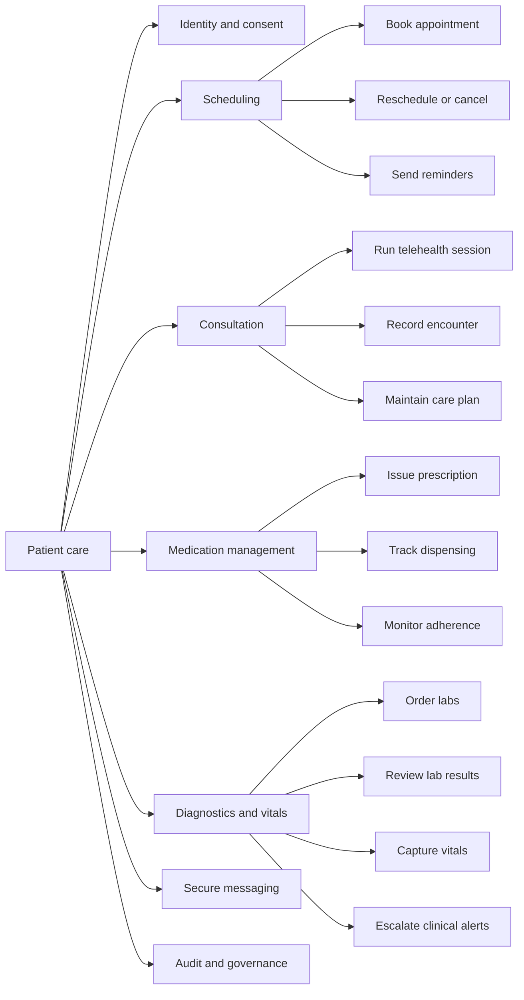
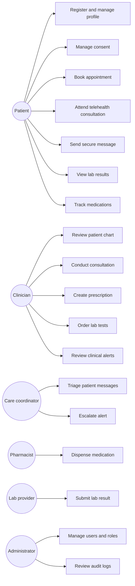

# 01. CIM Context Model

The computation independent model describes the healthcare problem and stakeholder goals without committing to a framework, database, or deployment platform.

## Stakeholders

| Stakeholder | Goal | Primary concerns |
| --- | --- | --- |
| Patient | Access care, appointments, medications, results, and secure messages | Ease of use, privacy, reminders, continuity of care |
| Clinician | Review patient context, conduct consultations, prescribe, and follow up | Clinical safety, complete records, decision support |
| Care coordinator | Triage messages, coordinate follow-ups, monitor alerts | Work queue clarity, escalation paths |
| Pharmacist | Fulfill prescriptions and report dispensing status | Prescription validity, dosage clarity |
| Lab provider | Receive lab orders and return results | Correct patient matching, result integrity |
| System administrator | Manage users, access, configuration, and audit obligations | Security, role-based access control, compliance |

## Capability Map

## Use Case Diagram

## Business Rules At CIM Level

- A patient must grant active consent before telehealth care can start.
- A clinical action must be attributable to an authenticated user or trusted system actor.
- A patient cannot have two confirmed appointments that overlap.
- A clinician cannot sign a prescription if a blocking allergy or interaction is unresolved.
- Critical lab results and out-of-range vitals must create a reviewable clinical alert.
- Clinical records must preserve audit history when viewed, changed, signed, or transmitted.
