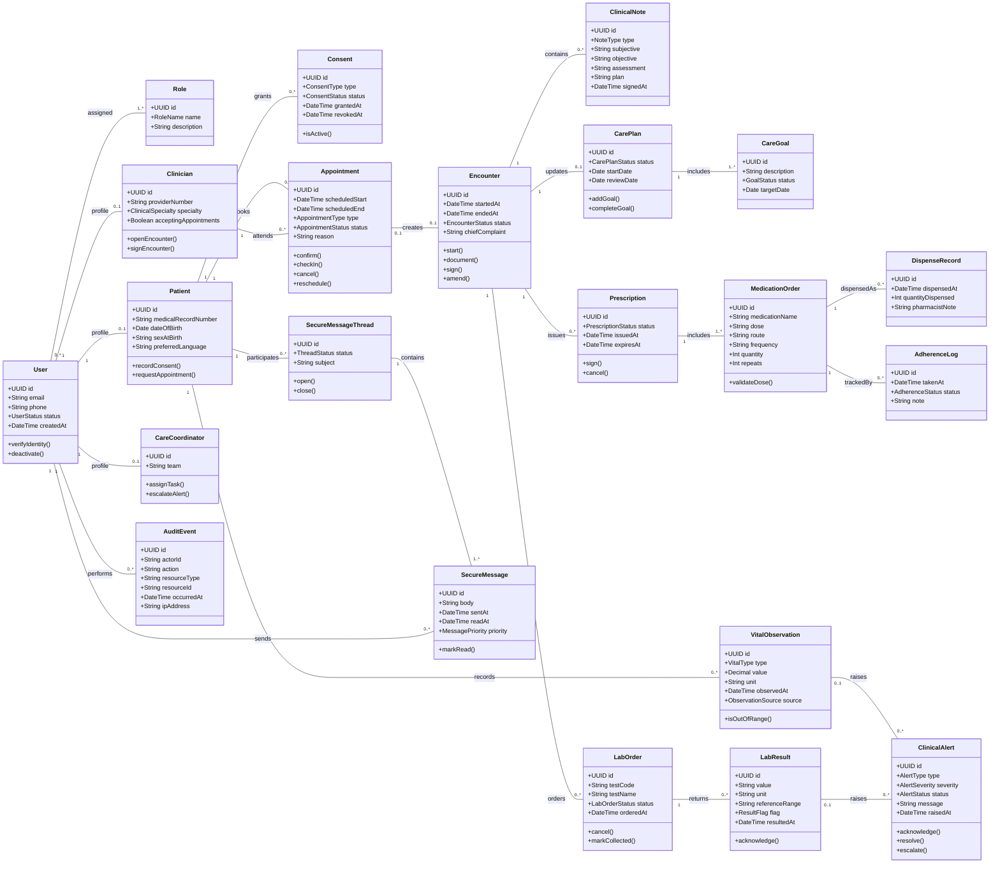

# 02. PIM Domain Class Model

The platform independent class model focuses on domain semantics, not implementation details such as controllers, framework hooks, or SQL column syntax.

## Modeling Notes

- `User` is separated from clinical profiles so authentication can evolve independently from patient and clinician records.
- `Consent` and `AuditEvent` are modeled as domain concepts, not secondary infrastructure.
- `Prescription` is the legal clinical artifact. `MedicationOrder` represents one medication line inside the prescription.
- `ClinicalAlert` can originate from multiple clinical facts, such as vital observations or lab results.
- `SecureMessageThread` is modeled separately from `SecureMessage` so triage, escalation, and closure can occur at the conversation level.
