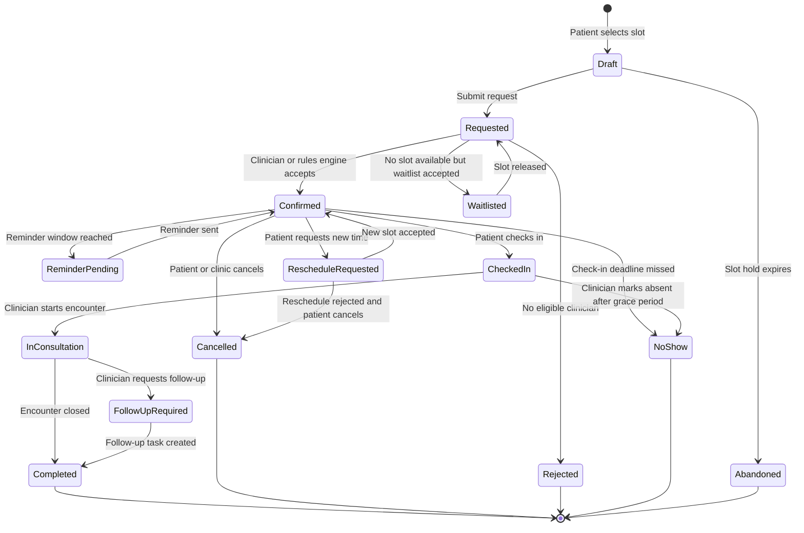
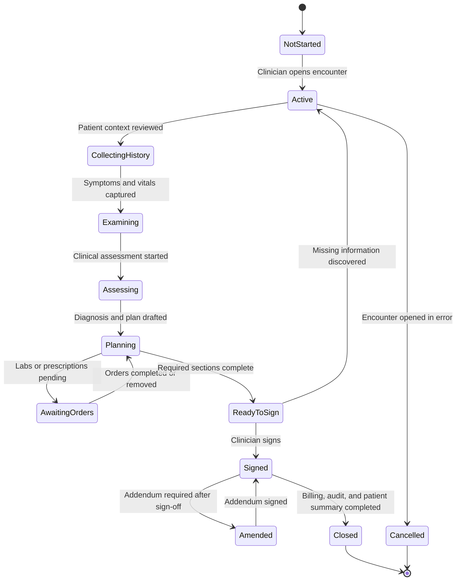
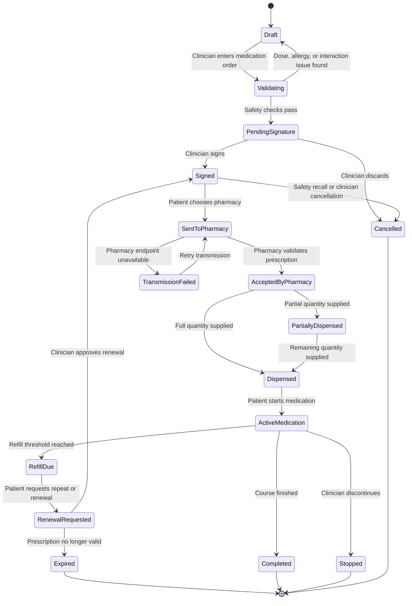
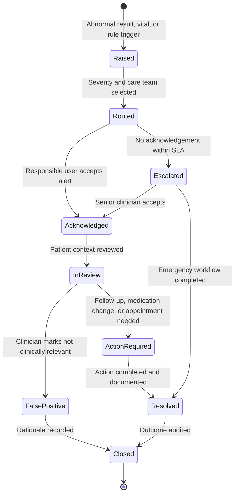
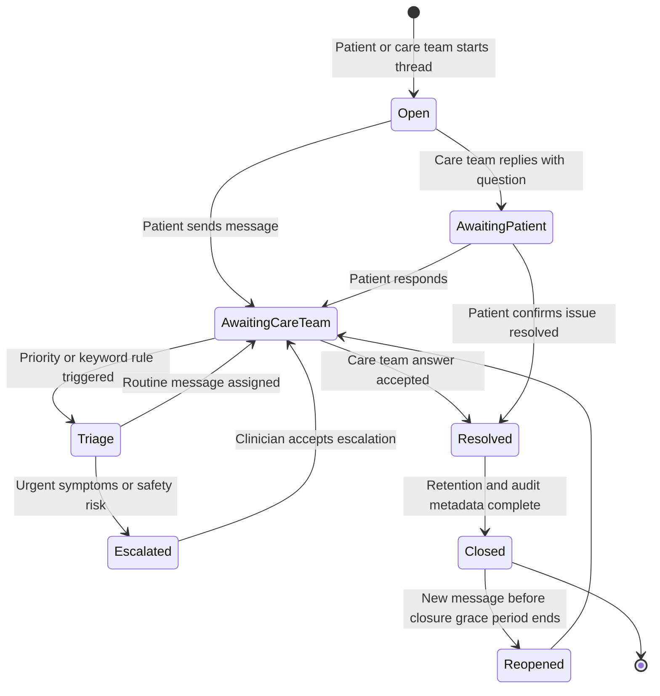

# 03. PIM State Models

These state diagrams are behavioral and business-facing. They show lifecycle, guards, and events without turning into implementation code.

## Appointment Lifecycle

## Encounter Lifecycle

## Prescription Lifecycle

## Clinical Alert Lifecycle

## Secure Message Thread Lifecycle

## State Model Implementation Guidance

| State model | Domain aggregate | Commands to derive | Tests to derive |
| --- | --- | --- | --- |
| Appointment lifecycle | Appointment | request, confirm, check in, reschedule, cancel, complete | invalid overlap, expired slot hold, no-show deadline |
| Encounter lifecycle | Encounter | open, save note, order item, sign, amend, close | cannot sign incomplete note, amendment requires signed encounter |
| Prescription lifecycle | Prescription | draft order, validate, sign, transmit, record dispense, renew | allergy block, expiry, repeat count, transmission retry |
| Clinical alert lifecycle | ClinicalAlert | raise, route, acknowledge, escalate, resolve, close | SLA escalation, false positive rationale, critical routing |
| Message thread lifecycle | SecureMessageThread | open, post message, triage, escalate, resolve, close, reopen | urgent keyword routing, closed thread grace period |
