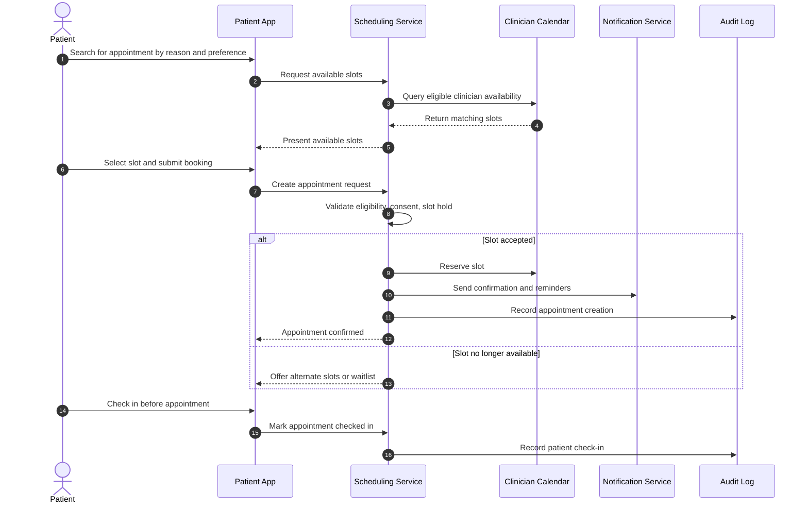
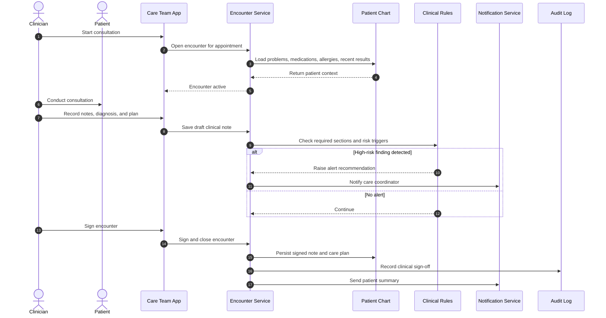
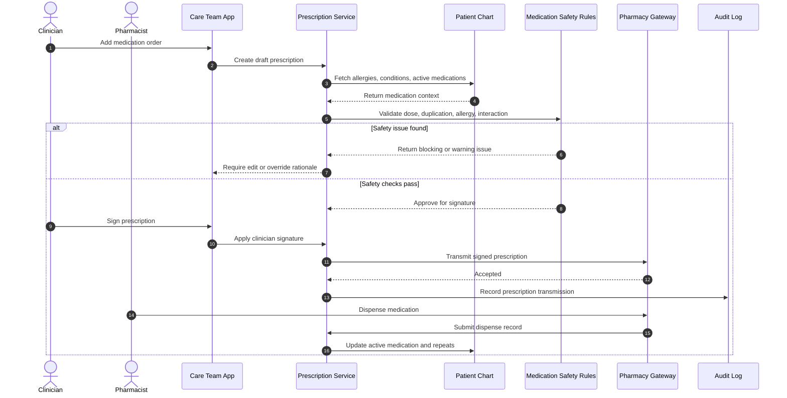
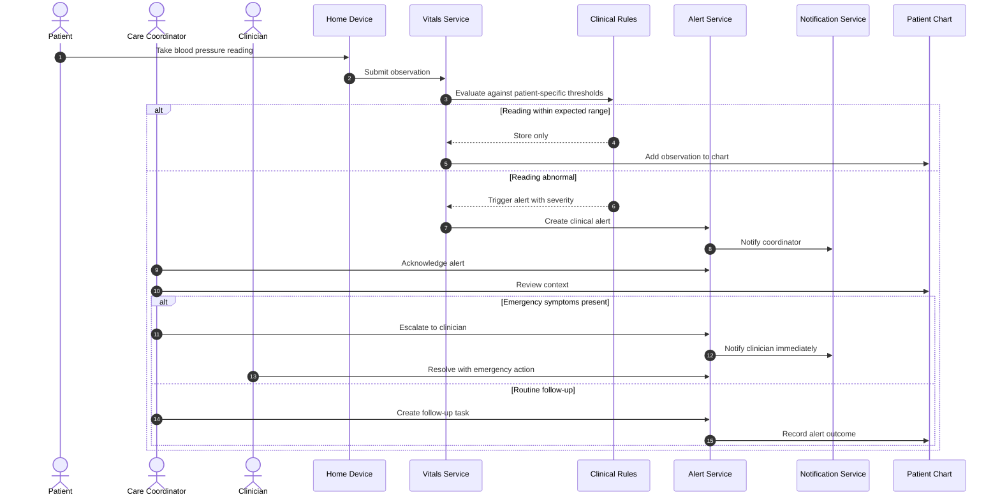
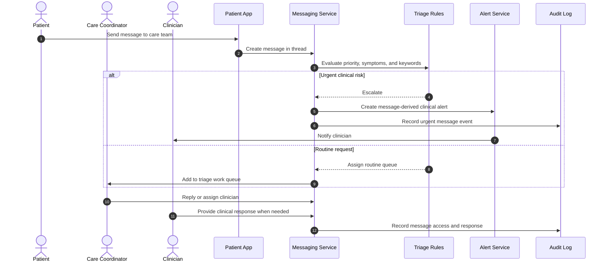

# 04. PIM Sequence Models

Sequence diagrams add dynamic richness to the state models by showing cross-boundary collaboration. Participants represent responsibilities, not specific libraries.

## Appointment Booking And Check-In

## Telehealth Encounter And Care Plan

## Prescription Safety And Dispensing

## Abnormal Vital Sign Alert

## Patient Secure Messaging Triage

