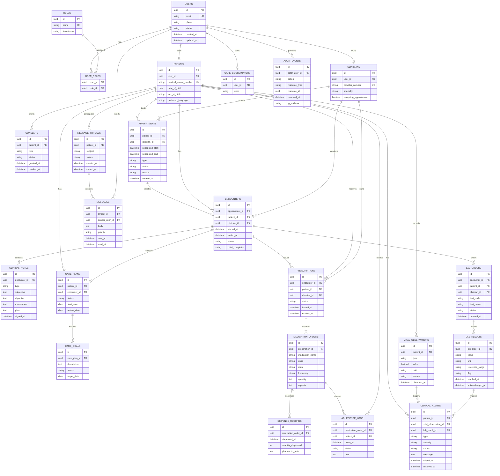

# 05. PIM ER Model

The ER model derives from the domain class model but is normalized for storage. Audit and consent are first-class because they are not optional in clinical systems.

## Storage Notes

- `USER_ROLES` is a join table because one user can hold multiple roles, such as clinician and administrator.
- `PATIENTS`, `CLINICIANS`, and `CARE_COORDINATORS` are role-specific profiles owned by `USERS`.
- `ENCOUNTERS` stores direct `patient_id` and `clinician_id` for query efficiency and historical stability, even though it also relates to `APPOINTMENTS`.
- `CLINICAL_ALERTS` allows nullable origin references because alerts can be raised from vitals, lab results, messages, or manual clinician review.
- `AUDIT_EVENTS.resource_type` plus `resource_id` avoids coupling audit storage to every clinical table.
