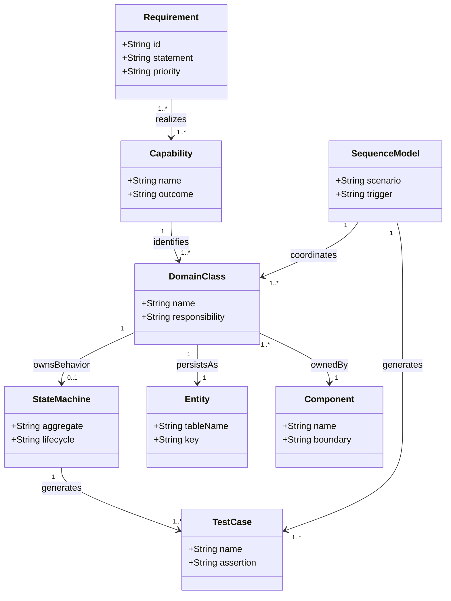
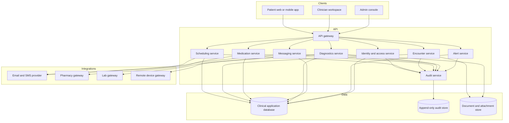
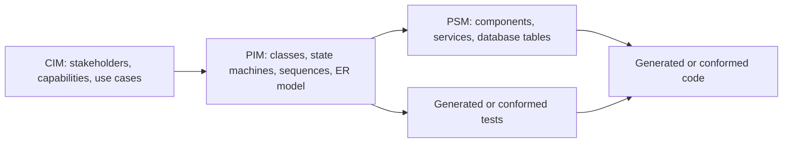

# 06. PSM, Transformations, And Traceability

This file links the higher-level MDE models to implementable artifacts. It is intentionally platform-aware without choosing a specific framework.

## MDE Metamodel

This small metamodel describes how the artifacts relate. It is useful when explaining why the diagrams form an MDE approach instead of isolated documentation.



## Component Boundary Model



## Transformation Targets

| Source model element | Generated or conformed artifact | Example target |
| --- | --- | --- |
| Class attributes | Validation schema, DTO, API schema | `Patient.dateOfBirth` becomes required date validation |
| Class associations | API includes, database foreign keys | `Appointment.patient` becomes `appointments.patient_id` |
| State transitions | Domain service commands and tests | `Appointment.confirm()` only valid from `Requested` |
| State guards | Business rule validators | Prescription cannot move to `Signed` with blocking allergy issue |
| Sequence messages | API endpoint contract or application service method | `CreateAppointmentRequest` command |
| ER entities | Database migrations and ORM models | `LAB_RESULTS` table and `LabResult` repository |
| Component boundaries | Service modules and deployment topology | Medication service owns prescription safety workflow |
| Invariants | Unit tests, property tests, database constraints | Encounter cannot be signed without clinician and patient |

## Traceability Matrix

| Requirement | Domain model | Behavior model | Data model | Candidate test |
| --- | --- | --- | --- | --- |
| Patient books appointment | Patient, Appointment, Clinician | Appointment lifecycle, booking sequence | PATIENTS, CLINICIANS, APPOINTMENTS | Confirmed appointment reserves one clinician slot |
| Clinician conducts consultation | Encounter, ClinicalNote, CarePlan | Encounter lifecycle, telehealth sequence | ENCOUNTERS, CLINICAL_NOTES, CARE_PLANS | Signed encounter requires note sections |
| Clinician prescribes medication | Prescription, MedicationOrder | Prescription lifecycle, prescription sequence | PRESCRIPTIONS, MEDICATION_ORDERS | Blocking allergy prevents signing |
| Patient tracks medication adherence | MedicationOrder, AdherenceLog | Prescription lifecycle | ADHERENCE_LOGS | Missed doses produce adherence status history |
| Lab result creates alert | LabOrder, LabResult, ClinicalAlert | Clinical alert lifecycle | LAB_ORDERS, LAB_RESULTS, CLINICAL_ALERTS | Critical result raises routed alert |
| Home vital creates alert | VitalObservation, ClinicalAlert | Clinical alert lifecycle, vital alert sequence | VITAL_OBSERVATIONS, CLINICAL_ALERTS | Out-of-range vital escalates by severity |
| Patient messages care team | SecureMessageThread, SecureMessage | Message thread lifecycle | MESSAGE_THREADS, MESSAGES | Urgent message enters triage state |
| Admin audits access | User, Role, AuditEvent | Component boundary audit flow | USERS, ROLES, USER_ROLES, AUDIT_EVENTS | Protected resource access writes audit event |

## Domain Invariants

These constraints can be expressed as OCL, validation rules, database constraints, or service-level tests.

```text
Appointment.scheduledStart < Appointment.scheduledEnd
Appointment.status = Confirmed implies Appointment.clinician is not null
Appointment.status = CheckedIn implies Appointment.patient is not null

Encounter.status = Signed implies Encounter.clinician is not null
Encounter.status = Signed implies ClinicalNote.signedAt is not null
Encounter.status = Closed implies Encounter.endedAt is not null

Prescription.status = Signed implies Prescription.issuedAt is not null
Prescription.status = Signed implies Prescription.expiresAt > Prescription.issuedAt
MedicationOrder.quantity > 0
MedicationOrder.repeats >= 0

LabResult.flag = Critical implies ClinicalAlert.severity in {High, Critical}
VitalObservation.value must be compatible with VitalObservation.type and unit

Consent.status = Active implies Consent.revokedAt is null
SecureMessage.readAt is null or SecureMessage.readAt >= SecureMessage.sentAt
AuditEvent.actorId must reference an authenticated user or trusted system actor
```

## Suggested Model Transformations

### CIM To PIM

- Convert each capability into bounded domain concepts and use cases.
- Turn stakeholder interactions into use cases and sequence diagrams.
- Promote lifecycle-heavy concepts, such as appointment, encounter, prescription, and alert, into explicit state machines.
- Identify compliance concepts, such as consent and audit, as domain objects rather than infrastructure details.

### PIM To PSM

- Convert classes with identity into database entities and API resources.
- Convert value-like fields, such as status and type, into enums.
- Convert associations into foreign keys, join tables, and access policies.
- Convert state transitions into application service commands.
- Convert invariants into validation schemas, database constraints, and automated tests.
- Convert sequence diagram participants into service modules and integration adapters.

### PSM To Code And Tests

- Generate database migration stubs from the ER diagram.
- Generate TypeScript, Java, C#, or Kotlin domain classes from the class diagram.
- Generate OpenAPI paths from application service commands.
- Generate reducer or workflow tests from state diagrams.
- Generate integration tests from sequence diagrams.
- Generate role-based access tests from stakeholder and role mappings.

## MDE Presentation Angle

For an assignment or demo, present the artifacts as a transformation chain:



The key argument is that the diagrams are not decorative. They constrain implementation: states define valid commands, classes define entities and DTOs, sequences define service contracts, and the ER model defines persistence.
